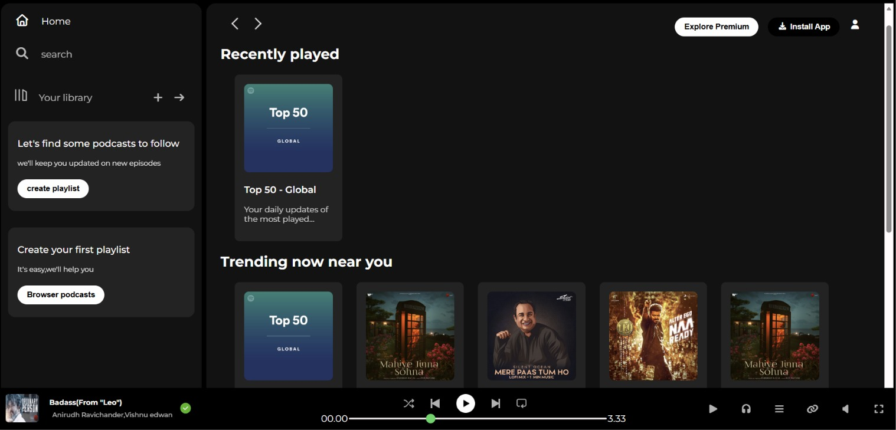

# 🎵 Spotify Clone - Responsive Music Streaming UI

A modern and responsive **Spotify Clone UI** built using **HTML5, CSS3, and Font Awesome**. This project replicates Spotify’s interface with a sidebar, sticky navigation, music player controls, playlists, cards, and responsive layouts.

---

## 🚀 Features

✨ Responsive Spotify-inspired Interface  
✨ Sidebar Navigation Menu  
✨ Sticky Navigation Bar  
✨ Music Player Controls  
✨ Recently Played & Trending Sections  
✨ Playlist Cards & Album Display  
✨ Hover Effects & Smooth UI  
✨ Responsive Design for Different Screens  
✨ Pure HTML & CSS (No JavaScript)

---

## 🛠️ Technologies Used

- **HTML5** → Structure
- **CSS3** → Styling & Layout
- **Font Awesome** → Icons
- **Google Fonts (Montserrat)** → Typography

---

## 📂 Project Structure

```bash
spotify-clone/
│
├── index.html
├── style.css
├── assets/
│      ├── card images
│      ├── player icons
│      ├── logo
│      ├── library icons
│      └── navigation icons
│
├── screenshot.png
└── README.md
```

---

## 🎯 Key Components

### Sidebar
- Home Navigation
- Search
- Library
- Playlist Creation
- Podcast Suggestions

### Main Content
- Recently Played
- Trending Songs
- Featured Charts
- Sticky Navigation

### Music Player
- Album Cover
- Song Information
- Playback Controls
- Progress Bar
- Volume Controls

---

## 📸 Project Preview

Add your screenshot here:


(Important: Remove the triple backticks when adding in README)

Example:



---

## ⚙️ Installation

Clone repository:

```bash
git clone https://github.com/yourusername/spotify-clone.git
```

Move into folder:

```bash
cd spotify-clone
```

Open:

```bash
index.html
```

Run using **Live Server**.

---

## 📚 Concepts Practiced

✔ CSS Flexbox  
✔ Responsive Design  
✔ Positioning  
✔ Sticky Navigation  
✔ Hover Effects  
✔ Media Queries  
✔ Music Player UI  
✔ Sidebar Layout  
✔ Custom Progress Bar Styling  

---

## 🔮 Future Improvements

- Add JavaScript functionality
- Integrate Spotify API
- Add Audio Playback
- Dark/Light Theme
- Mobile Optimization
- Search Functionality

---

## 👨‍💻 Author

**Srujan V**

Interested in:

- Full Stack Development
- MERN Stack
- AI Projects
- UI/UX Design
- Web Development

GitHub:

https://github.com/Srujan-017

---

## ⭐ Support

If you like this project, give it a **Star ⭐**

---

### Built with ❤️ using HTML, CSS & Creativity
